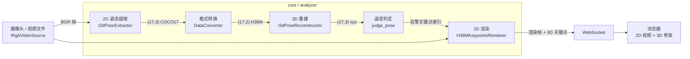

# KPS Analyze Demo

实时 2D/3D 人体姿态估计管道——捕获视频帧、提取骨骼关键点、重建 3D 姿态、渲染叠加层、通过 WebSocket 推送到浏览器。

## 快速开始

```bash
# 开发机（预录视频，此处指定视频为 ./sample_data/video_39.mp4）
python main.py --video-path ./sample_data/video_39.mp4

# 目标机（真实摄像头，此处指定摄像头序号为0，摄像头序号需要视实际需要更改）
python main.py --analyzer default --camera 0 --width 640 --height 480 --fps 30
```

浏览器打开 `http://localhost:2800`。

## 工作流



### 各环节说明

**1. 视频源** (`core/video_source/`)

| 类                     | 来源                            | 平台            |
| ---------------------- | ------------------------------- | --------------- |
| `CameraRgbVideoSource` | 实时摄像头 (`cv2.VideoCapture`) | Linux / Windows |
| `MockRgbVideoSource`   | 预录 `.mp4` 文件，循环播放      | 任意            |

均实现 `IRgbVideoSource` 接口（width, height, fps, flip_x/y, get_frame）。

**2. 2D 姿态提取** (`core/kp2d_extractor.py`)

| 类                       | 方法                                 | 输出格式         |
| ------------------------ | ------------------------------------ | ---------------- |
| `RTMPose2dPoseExtractor` | RTMDet + RTMPose，QNN DSP 推理       | COCO-17 `(17,3)` |
| `Mock2dExtractor`        | 读取预缓存的 `.npz` 关键点，逐帧循环 | H36M `(17,3)`    |

**3. 格式转换** (`core/converter.py`)

`DataConverter.coco17_to_h36m()` 将 COCO-17 关键点转换为 H36M 格式。11 个关节直接映射，6 个关节（骨盆、胸椎、脊椎、颈部、头顶）通过几何插值计算。

**4. 3D 重建** (`core/kp3d_reconstructor.py`)

| 类                            | 方法                               | 时间窗口 |
| ----------------------------- | ---------------------------------- | -------- |
| `MHFormer3dPoseReconstructor` | MHFormer 时序 Transformer，QNN DSP | 351 帧   |
| `Mock3dReconstructor`         | 返回全零                           | —        |

**5. 姿态判定** (`core/pose_judger.py` + `core/rules_loader.py`)

`judge_pose(kps_3d, rule)` 根据规则检查关节角度、相对位置等几何关系。规则文件为 `data/rules/<动作名>.json`。

**6. 渲染** (`core/renderer.py`)

`H36MKeypointsRenderer.render_on_frame()` 在 BGR 帧上绘制 H36M 骨架叠加层。默认使用低调的青蓝色点和线，告警关键点高亮为黄色点/红色线。

**7. 前端** (`static/index.html`)

单条 WebSocket 连接承载三类消息：

| 类型                                     | 方向            | 内容                                  |
| ---------------------------------------- | --------------- | ------------------------------------- |
| Binary (Blob)                            | 服务端 → 客户端 | JPEG 帧（视频 + 2D 骨架叠加）         |
| `{"type":"kps3d","data":[...]}`          | 服务端 → 客户端 | `17×3` 关键点坐标，驱动 3D 渲染       |
| `{"type":"log","ts":"...","text":"..."}` | 服务端 → 客户端 | 状态消息（右侧面板，最多保留 300 条） |
| `POST /poses`                            | 客户端 → 服务端 | 切换当前动作规则                      |

3D 骨架使用 **Three.js** (WebGL) 渲染。WebGL 不可用时自动降级为占位文字，其余功能不受影响。

### 目录结构

```
core/
├── analyzer.py              # FrameAnalyzer — 核心调度器
├── kp2d_extractor.py        # I2dPoseExtractor 及实现
├── kp3d_reconstructor.py    # I3dPoseReconstructor 及实现
├── converter.py             # DataConverter — COCO17 ↔ H36M
├── renderer.py              # H36MKeypointsRenderer — 2D 叠加渲染
├── pose_judger.py           # judge_pose() — 规则引擎
├── rules_loader.py          # 从 data/rules/*.json 加载规则
└── video_source/            # IRgbVideoSource + 摄像头/视频实现

rtm-det-aidlite/             # RTMDet + RTMPose QNN 模型
mhformer-aidlite/            # MHFormer QNN 模型 (351 帧窗口)
sample_data/                 # 测试视频与缓存关键点
static/index.html            # 前端单页应用
data/rules/                  # 姿态判定规则 (JSON)
```
