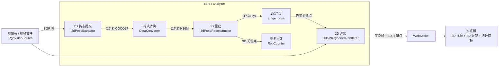

# KPS Analyze Demo

实时 2D/3D 人体姿态估计管道——捕获视频帧、提取骨骼关键点、重建 3D 姿态、渲染叠加层、通过 WebSocket 推送到浏览器。

## 快速开始

**开发环境（预录视频 + mock 分析器）：**

```bash
uv run main.py --analyzer-2d mock --analyzer-3d mock --camera -1 --video-path ./sample_data/small/example.mp4
```

**实机环境（真实摄像头 + 真实分析器）：**

```bash
python main.py --analyzer-2d rtmpose --analyzer-3d mhformer --camera 0 --width 640 --height 480 --fps 30
```

> --camera 的具体值取决于目标摄像头的序号

浏览器打开 `http://localhost:2800`。

## 工作流



### 各环节说明

**1. 视频源** (`core/video_source/`)

| 类                     | 来源                            | 平台            |
| ---------------------- | ------------------------------- | --------------- |
| `CameraRgbVideoSource` | 实时摄像头 (`cv2.VideoCapture`) | Linux / Windows |
| `MockRgbVideoSource`   | 预录 `.mp4` 文件，循环播放      | 任意            |

均实现 `IRgbVideoSource` 接口（`width`, `height`, `fps`, `flip_x`/`flip_y`, `get_frame`）。

**2. 2D 姿态提取** (`core/kp2d_extractor/`)

| 类                       | 方法                                 | 输出格式         |
| ------------------------ | ------------------------------------ | ---------------- |
| `RTMPose2dPoseExtractor` | RTMDet + RTMPose，QNN DSP 推理       | COCO-17 `(17,3)` |
| `Mock2dExtractor`        | 读取预缓存的 `.npz` 关键点，逐帧循环 | COCO-17 `(17,3)` |

**3. 格式转换** (`core/converter.py`)

`DataConverter.coco17_to_h36m()` 将 COCO-17 关键点转换为 H36M 格式 `(17,3) → (17,2)`。11 个关节直接映射，6 个关节通过几何插值计算。

**4. 3D 重建** (`core/kp3d_reconstructor/`)

| 类                            | 方法                               | 时间窗口 |
| ----------------------------- | ---------------------------------- | -------- |
| `MHFormer3dPoseReconstructor` | MHFormer 时序 Transformer，QNN DSP | 351 帧   |
| `Mock3dReconstructor`         | 读取预缓存的 `.npz`                | —        |

**5. 姿态判定** (`core/pose_judger.py` + `core/rules_loader.py`)

`judge_pose(kps_3d, rule)` 根据规则检查关节角度、相对位置等几何关系。违规需持续约 1 秒（可配）才上报，同一段违规只报一次（去抖）。

**6. 渲染** (`core/renderer.py`)

`H36MKeypointsRenderer.render_on_frame()` 在 BGR 帧上绘制 H36M 骨架。默认暖金色点/线，告警关键点高亮为青绿点/橙红线。

**7. 前端** (`static/index.html`)

单条 WebSocket 承载多类消息：

| 类型 | 内容 |
| --- | --- |
| Binary (Blob) | JPEG 帧（视频 + 2D 骨架叠加） |
| `{"type":"kps3d","data":[...]}` | 17×3 关键点坐标，驱动 3D 渲染 |
| `{"type":"log","ts":"...","text":"..."}` | 状态消息（违规、计数等） |
| `{"type":"stats",...}` | 实时训练统计（每 30 帧推送） |

前端包含：左侧视频区 + 3D 骨架（Three.js）、右侧控制按钮（开始/暂停/停止）、统计面板、训练历史列表、消息日志。3D 使用 WebGL 渲染，不可用时自动降级。

**8. REST API**

| 端点 | 方法 | 用途 |
| --- | --- | --- |
| `/poses` | GET / POST | 查看和切换动作规则集 |
| `/control/start` | POST | 开始 / 恢复训练 |
| `/control/pause` | POST | 暂停分析（视频和 3D 继续） |
| `/control/stop` | POST | 停止训练，保存统计数据 |
| `/stats/{training_id}` | GET | 获取某次训练统计（`latest` = 最近一次） |
| `/history` | GET | 所有训练历史列表 |

---

## 统计数据

`FrameAnalyzer` 通过 `state` 属性管理三态（`running` / `paused` / `stopped`），并暴露以下实时统计属性：

| 属性 | 含义 | 计算方式 |
| --- | --- | --- |
| `training_id` | 当前训练 8 位 ID | UUID 截取 |
| `rep_count` | 动作重复次数 | `RepCounter` 状态机边沿触发计数 |
| `accuracy` | 动作标准率 (0.0~1.0) | `1 − 违规帧数 / 有效分析帧数` |
| `rom` | 髋关节活动度（度） | 所有 rep 的特征值振幅（max−min）的均值 |
| `balance_score` | 左右发力均衡度 (0~100) | 基于 ROM 波动的变异系数 |
| `density` | 训练密度（次/分钟） | `rep_count / 训练分钟数` |
| `calories` | 估算消耗热量（千卡） | `rep_count × calories_per_rep`（规则文件定义） |
| `duration_seconds` | 训练持续时间（秒） | 从训练开始到当前的墙钟时间 |
| `fatigue_score` | 肌肉疲劳度 (0~100) | ROM 衰减率 × 0.4 + 动作速度衰减率 × 0.3 + 违规上升率 × 0.3 |

### 状态行为

- **running** — 全管线运行，统计数据实时更新
- **paused** — 2D/3D 继续（骨架仍在画面中更新），停 judge + rep_count，统计值冻结不变
- **stopped** — 功能同 paused；保存统计快照到历史队列（最近 64 条），所有统计属性返回冻结的最终值。再次点击"开始"生成新 `training_id` 并清零所有计数器

### 统计数据获得方式

- **WebSocket 实时推送**：每 30 帧（约 1 秒）通过 `{"type":"stats", ...}` 推送全部指标
- **REST 查询**：`GET /stats/latest` 获取最近一次完成的训练数据
- **APP 端整合**：`/history` 获取所有历史训练列表，前端按需查询具体某次训练的 `/stats/{id}`

---

## 目录结构

```
core/
├── analyzer.py              # FrameAnalyzer — 核心调度器 + RepCounter + TrainingStats
├── kp2d_extractor/          # I2dPoseExtractor 接口 + Mock + RTMPose 实现
├── kp3d_reconstructor/      # I3dPoseReconstructor 接口 + Mock + MHFormer 实现
├── converter.py             # DataConverter — COCO17 ↔ H36M
├── renderer.py              # H36MKeypointsRenderer — 2D 骨架叠加渲染
├── pose_judger.py           # judge_pose() — 规则引擎
├── rep_counter.py           # 重复计数特征提取
├── rules_loader.py          # 从 data/rules/*.json 加载规则
└── video_source/            # IRgbVideoSource + 摄像头/视频实现

rtm-det-aidlite/             # RTMDet + RTMPose QNN 模型
mhformer-aidlite/            # MHFormer QNN 模型 (351 帧窗口)
sample_data/                 # 测试视频与缓存关键点
static/index.html            # 前端单页应用
data/rules/                  # 姿态判定规则 + 热量/平衡配置 (JSON)
```
