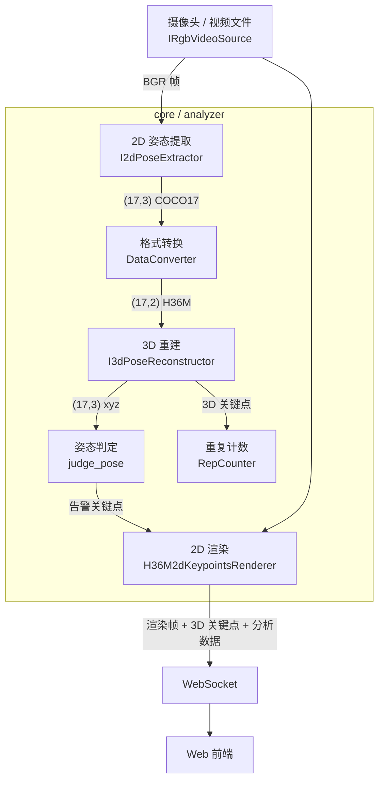

# KPS Analyze Demo

实时 2D/3D 人体姿态估计管道——捕获视频帧、提取骨骼关键点、重建 3D 姿态、判定动作质量、计次、渲染叠加层、通过 WebSocket 推送到浏览器。

## 1. 环境信息

| 项目     | 详情                                                     |
| -------- | -------------------------------------------------------- |
| 包管理器 | [uv](https://docs.astral.sh/uv/)（Python\>=3.10,\<3.11） |
| 目标 SoC | Qualcomm QCS8550（ARM + DSP，实机部署）                  |
| 关键依赖 | FastAPI、OpenCV、NumPy、ONNX Runtime、Uvicorn            |

> 开发阶段可在任意 Linux / Windows / WSL2 环境下以 mock 模式运行，无需 QCS8550 硬件。

Mock 模式的意义：用预录视频（`.mp4`）和预提取的骨骼关键点（`.npz`）替代实时摄像头和 QNN 推理管线。开发者在普通 PC 上即可调试管线逻辑、姿态判定规则、前端 UI 和 WebSocket 通信，无需真实硬件投入。

```bash
# 安装 uv（如未安装）
curl -LsSf https://astral.sh/uv/install.sh | sh

# 同步依赖
uv sync
```

## 2. 快速开始

### 2.1. 开发环境（预录视频 + mock 分析器）

```bash
uv run main.py --analyzer-2d mock --analyzer-3d mock --camera -1
```

Mock 模式使用 `sample_data/example-1/`（哈克深蹲）下的预录视频和缓存关键点。

**`sample_data/` 预录数据：**

| 目录                     | 动作     | 文件                                                              |
| ------------------------ | -------- | ----------------------------------------------------------------- |
| `sample_data/example-1/` | 哈克深蹲 | `video.mp4`、`2d_coco17_kps.npz`、`2d_h36m_kps.npz`、`3d_kps.npz` |
| `sample_data/example-2/` | 高位下拉 | 同上                                                              |

每个示例目录含四类文件：视频（`.mp4`）、COCO17 格式 2D 关键点（`2d_coco17_kps.npz`）、H36M 格式 2D 关键点（`2d_h36m_kps.npz`）、3D 关键点（`3d_kps.npz`）。

**切换到不同示例：**

```bash
# 哈克深蹲（默认）
uv run main.py --analyzer-2d mock --analyzer-3d mock --camera -1

# 高位下拉（切换视频和骨骼文件）
uv run main.py \
    --analyzer-2d mock \
    --analyzer-3d mock \
    --camera -1 \
    --video-path ./sample_data/example-2/video.mp4 \
    --mock-kp2d ./sample_data/example-2/2d_h36m_kps.npz \
    --mock-kp3d ./sample_data/example-2/3d_kps.npz
```

`--video-path` 指定预录视频文件，`--mock-kp2d` / `--mock-kp3d` 指定 2D/3D 骨骼缓存文件（mock 模式下适用）。各项均可独立指定，例如使用 example-1 的视频搭配 example-2 的骨骼。

#### 2.1.1. 预录数据说明

**骨骼数据生成**：H36M 和 COCO17 格式的 2D 骨骼以及 H36M 格式的 3D 骨骼 `.npz` 文件均可通过项目 [kps_analyze_demo](https://github.com/hiromuraki/kps_analyze_demo) 的在线推理功能手动生成，配合对应视频文件即可在 mock 模式下使用。建议将生成后的文件放入 `sample_data/<示例名>/` 目录以便于管理。

**视频源**：推荐 640×480 分辨率。较低分辨率可降低 JPEG 编码开销和 WebSocket 传输带宽，同时足以保持骨架提取精度。

### 2.2. 实机环境（真实摄像头 + 真实分析器）

```bash
uv run main.py \
    --analyzer-2d rtmpose \
    --analyzer-3d mhformer \
    --camera 0 \
    --width 640 --height 480 --fps 30
```

> `--camera` 值为目标摄像头的设备序号；`-1` 表示使用预录视频文件。

### 2.3. 通过 WebUI 预览

**开发 UI（显示详细信息）：**

浏览器打开 `http://localhost:2800`。

### 2.4. 预设启动脚本

项目根目录提供 `run-*.sh` 便捷脚本，封装常用命令组合。

| 脚本                    | 模式    | 前端         | 说明                                                                 |
| ----------------------- | ------- | ------------ | -------------------------------------------------------------------- |
| `run-mock-example-1.sh` | 全 mock | 开发 UI      | 哈克深蹲预录数据                                                     |
| `run-mock-example-2.sh` | 全 mock | 开发 UI      | 高位下拉预录数据                                                     |
| `run-rule-builder.sh`   | 全 mock | Rule Builder | 规则编辑工具，启动后需要上传视频文件以及对应的 H36M 2D/3D 骨骼以使用 |

## 3. 工作流


```mermaid
flowchart TB
    A["摄像头 / 视频文件\nIRgbVideoSource"] -->|"BGR 帧"| B

    subgraph C [core / analyzer]
        B["2D 姿态提取\nI2dPoseExtractor"] -->|"(17,3) COCO17"| D["格式转换\nDataConverter"]
        D -->|"(17,2) H36M"| E["3D 重建\nI3dPoseReconstructor"]
        E -->|"(17,3) xyz"| F["姿态判定\njudge_pose"]
        E -->|"3D 关键点"| J["重复计数\nRepCounter"]
        F -->|"告警关键点"| G["2D 渲染\nH36M2dKeypointsRenderer"]
    end

    A --> G
    G -->|"渲染帧 + 3D 关键点 + 分析数据"| H["WebSocket"]
    H --> I["Web 前端"]
```

### 3.1. 各环节说明

**1. 视频源** (`core/video_source/`)

| 类                     | 来源                            | 平台            |
| ---------------------- | ------------------------------- | --------------- |
| `CameraRgbVideoSource` | 实时摄像头 (`cv2.VideoCapture`) | Linux / Windows |
| `MockRgbVideoSource`   | 预录 `.mp4` 文件，循环播放      | 任意            |

均实现 `IRgbVideoSource` 接口（`width`、`height`、`fps`、`flip_x`/`flip_y`、`get_frame`）。

**2. 2D 姿态提取** (`core/kp2d_extractor/`)

| 类                       | 方法                               | 输出格式         |
| ------------------------ | ---------------------------------- | ---------------- |
| `RTMPose2dPoseExtractor` | RTMDet + RTMPose，QNN DSP 推理     | COCO-17 `(17,3)` |
| `Mock2dExtractor`        | 读取预缓存 `.npz` 关键点，逐帧循环 | COCO-17 `(17,3)` |

Mock 所用的 2D 骨骼文件路径由启动参数 `--mock-kp2d` 指定；`data_out` 属性声明输出格式（`"COCO17"` 或 `"H36M"`），`FrameAnalyzer` 按需调用 `DataConverter` 转换。

**3. 格式转换** (`core/converter.py`)

`DataConverter.coco17_to_h36m()` 将 COCO-17 关键点转换为 H36M 格式 `(17,3) → (17,2)`。11 个关节直接映射，6 个关节通过几何插值计算。

**4. 3D 重建** (`core/kp3d_reconstructor/`)

| 类                            | 方法                               | 时间窗口 |
| ----------------------------- | ---------------------------------- | -------- |
| `MHFormer3dPoseReconstructor` | MHFormer 时序 Transformer，QNN DSP | 351 帧   |
| `Mock3dReconstructor`         | 读取预缓存 `.npz`                  | —        |

Mock 所用的 3D 骨骼文件路径由启动参数 `--mock-kp3d` 指定。

**5. 姿态判定** (`core/pose_judger.py`)

`judge_pose(kp2d, kp3d, rule, motion="")` 根据规则检查关节角度等几何关系：
- **阶段过滤**：规则可指定 `phase`（列表），仅当当前 `motion` 匹配时生效
- **数据源选择**：规则可设 `keypoints_mode`（`"2d"` 或 `"3d"`），指定使用哪个坐标源计算角度
- **规则类型**：`"夹角"`（四点线段夹角）和 `"水平夹角"`（两点连线与水平面角度，如检测高低肩）
- **去抖**：违规需持续约 1 秒（30 帧）才上报，同一段违规只报一次

**6. 动作计数** (`core/rep_counter.py`)

`RepCounter` 状态机追踪动作阶段和重复次数：
- **EMA 平滑**：原始特征值经指数移动平均过滤高频噪声
- **方向去抖**：平滑值的一阶差分方向需连续 N 帧一致才切换阶段
- **阶段输出**：`descent`（下降）、`ascent`（上升）、`static_up`（顶部静止）、`static_down`（底部静止）
- **可调参数**：`ema_alpha`、`motion_debounce`、`delta_threshold`（可在规则文件中按动作覆盖）

**7. 渲染** (`core/renderer.py`)

`H36M2dKeypointsRenderer.render_on_frame()` 在 BGR 帧上绘制 H36M 骨架（16 条骨骼连线）。默认蓝绿色点/线，告警关键点高亮为黄色点/红色线。

**8. 前端页面**

| 页面                       | 端口 | 用途                                                                                                     |
| -------------------------- | ---- | -------------------------------------------------------------------------------------------------------- |
| `static/index.html`        | 2800 | Debug/开发者 UI：3D 骨架（Three.js）、统计面板、训练历史、消息日志。支持 `?pose=<名称>` 查询参数预设动作 |
| `static/rule-builder.html` | 2800 | 规则构建器：视频+骨骼预览、SVG 骨骼选择器、帧级别规则录制、JSON 导出                                     |
| `static/ema.html`          | 任意 | EMA 平滑 + 方向去抖可视化演示（独立页面，无需服务端）                                                    |

单条 WebSocket 承载多类消息：

| 类型                                     | 内容                                                          |
| ---------------------------------------- | ------------------------------------------------------------- |
| Binary (Blob)                            | JPEG 帧（视频 + 2D 骨架叠加）                                 |
| `{"type":"kps3d","data":[...]}`          | 17×3 关键点坐标，驱动 3D 渲染（含 `motion`、`feature_value`） |
| `{"type":"log","ts":"...","text":"..."}` | 状态消息（违规、计数等）                                      |
| `{"type":"stats",...}`                   | 实时训练统计（每 30 帧推送）                                  |
| `{"type":"alert","text":"..."}`          | Demo UI 告警消息（原本由 `example.py` 使用）                  |

**9. REST API**

| 端点                          | 方法       | 用途                                                                                      |
| ----------------------------- | ---------- | ----------------------------------------------------------------------------------------- |
| `/poses`                      | GET / POST | 查看和切换动作规则集                                                                      |
| `/control/{start,pause,stop}` | POST       | 训练会话生命周期                                                                          |
| `/stats/{training_id}`        | GET        | 获取某次训练统计（`latest` = 最近一次）                                                   |
| `/history`                    | GET        | 所有训练历史列表                                                                          |
| `/api/upload_npz`             | POST       | 上传 `.npz` 骨骼文件，返回 `{frames, bones_topology, num_frames}`（供 Rule Builder 使用） |

> 注：无需关注此 API，该 API 仅由前端开发界面使用，不属于正式应用。

---

## 4. 统计数据

`FrameAnalyzer` 通过 `state` 属性管理三态（`running` / `paused` / `stopped`），并暴露以下实时统计属性：

| 属性                | 含义                    | 计算方式                                                   |
| ------------------- | ----------------------- | ---------------------------------------------------------- |
| `analyzer_id`       | 当前分析器的 UUID       | 每次创建时随机生成                                         |
| `training_id`       | 当前训练 8 位 ID        | UUID 截取                                                  |
| `rep_count`         | 动作重复次数            | `RepCounter` 状态机边沿触发计数                            |
| `rep_feature_value` | 当前特征值（角度/距离） | EMA 平滑后的实时值                                         |
| `accuracy`          | 动作标准率 (0.0~1.0)    | `1 − 违规帧数 / 有效分析帧数`                              |
| `rom`               | 关节活动度（度）        | 所有 rep 的特征值振幅（max−min）的均值                     |
| `balance_score`     | 左右发力均衡度 (0~100)  | 基于 ROM 波动的变异系数                                    |
| `density`           | 训练密度（次/分钟）     | `rep_count / 训练分钟数`                                   |
| `calories`          | 估算消耗热量（千卡）    | `rep_count × calories_per_rep`（规则文件定义）             |
| `duration_seconds`  | 训练持续时间（秒）      | 从训练开始到当前的墙钟时间                                 |
| `fatigue_score`     | 肌肉疲劳度 (0~100)      | ROM 衰减率 × 0.4 + 动作速度衰减率 × 0.3 + 违规上升率 × 0.3 |

### 4.1. 状态行为

- **running** — 全管线运行，统计数据实时更新
- **paused** — 2D/3D 继续（骨架仍在画面中更新），停 judge + rep_count，统计值冻结不变
- **stopped** — 功能同 paused；保存统计快照到历史队列（最近 64 条），所有统计属性返回冻结的最终值。再次点击"开始"生成新 `Analyzer` 并清零所有计数器

### 4.2. 统计数据获得方式

- **WebSocket 实时推送**：每 30 帧（约 1 秒）通过 `{"type":"stats", ...}` 推送全部指标
- **REST 查询**：`GET /stats/latest` 获取最近一次完成的训练数据
- **APP 端整合**：`/history` 获取所有历史训练列表，前端按需查询具体某次训练的 `/stats/{id}`
- **后端整合获取**：将本项目嵌入到应用端，直接通过属性访问获取。

---

## 5. 规则文件格式

规则 JSON 文件存放在 `data/rules/`。

### 5.1. 当前格式

以动作 “哈克深蹲” 为例（[data/rules/哈克深蹲-new.json](data/rules/哈克深蹲-new.json)）：

```json
{
    "action_no": "04",
    "action_name": "哈克深蹲",
    "rule_set": [
        {
            "rule_no": "R1",
            "phase": ["static_down"],
            "keypoints_mode": "3d",
            "parts": [
                {
                    "rule_type": "夹角",
                    "rule_dim": "线段夹角",
                    "p1": "左髋",
                    "p2": "左膝",
                    "p3": "左膝",
                    "p4": "左脚踝",
                    "min_value": 90,
                    "max_value": 115
                },
                {
                    "rule_type": "夹角",
                    "rule_dim": "线段夹角",
                    "rule_ref": "无",
                    "p1": "右髋",
                    "p2": "右膝",
                    "p3": "右膝",
                    "p4": "右脚踝",
                    "min_value": 90,
                    "max_value": 115
                }
            ]
        },
        {
            "rule_no": "R2",
            "phase": ["static_up"],
            "keypoints_mode": "3d",
            "parts": [
                {
                    "rule_type": "夹角",
                    "rule_dim": "线段夹角",
                    "p1": "左髋",
                    "p2": "左膝",
                    "p3": "左膝",
                    "p4": "左脚踝",
                    "min_value": 170,
                    "max_value": 180
                },
                {
                    "rule_type": "夹角",
                    "rule_dim": "线段夹角",
                    "p1": "右髋",
                    "p2": "右膝",
                    "p3": "右膝",
                    "p4": "右脚踝",
                    "min_value": 170,
                    "max_value": 180
                }
            ]
        }
    ],
    "rep_counting": {
        "type": "angle",
        "p1": "左髋",
        "p2": "左膝",
        "p3": "左膝",
        "p4": "左脚踝",
        "top_threshold": 160,
        "delta_threshold": 0.3,
        "bottom_threshold": 115,
        "count_on": "down_up"
    },
    "calories_per_rep": 0.5,
    "balance_pairs": [
        [
            "左膝",
            "右膝"
        ],
        [
            "左髋",
            "右髋"
        ]
    ]
}
```

- `rule_set` — 规则数组，每条规则通过 `parts` 组合多个角度检查
- `phase` — 生效阶段列表：`["all"]` / `["static_up"]` / `["static_down"]` / `["descent"]` / `["ascent"]` 及其组合
- `keypoints_mode` — `"2d"` 或 `"3d"`，选择角度计算的数据源
- `rep_counting` — 可选，配置动作计数的特征值和阈值
- `balance_pairs` — 左右对称关节对，用于计算 `balance_score`

### 5.2. 旧格式（仅作说明）

旧格式使用扁平的 `rule_list`，无 `phase`/`keypoints_mode`/`parts` 字段。

保留此格式仅仅用作示例，且代码尚未完成更新。后续应全部迁移至新格式。

> 为了区分，采用新格式的规则文件用 `-new` 作为后缀。

---

## 6. 目录结构

```
core/
├── kp2d_extractor/          # I2dPoseExtractor 接口 + Mock + RTMPose 实现
├── kp3d_reconstructor/      # I3dPoseReconstructor 接口 + Mock + MHFormer 实现
├── video_source/            # IRgbVideoSource + 摄像头/视频实现
├── analyzer.py              # FrameAnalyzer — 核心调度器
├── rep_counter.py           # RepCounter — 动作计数状态机 + 特征提取函数
├── converter.py             # DataConverter — COCO17 ↔ H36M
├── renderer.py              # H36M2dKeypointsRenderer — 2D 骨架叠加渲染
├── pose_judger.py           # judge_pose() — 规则引擎（支持 phase/2D/3D）
└── rules_loader.py          # 从 data/rules/*.json 加载规则

rtm-det-aidlite/             # RTMDet + RTMPose QNN 模型
mhformer-aidlite/            # MHFormer QNN 模型 (351 帧窗口)
sample_data/                 # 测试视频与缓存关键点
data/rules/                  # 姿态判定规则 JSON 文件
static/
├── index.html               # Debug/开发者 UI
├── example.html             # AR 风格 Demo UI（已废弃，已有正式项目）
├── rule-builder.html        # 规则构建器
└── ema.html                 # EMA + 去抖可视化演示
run-rule-builder.sh          # 规则构建工具启动脚本
run-*.sh                     # 预制启动脚本
```

## 7. Rule Builder

可视化规则编辑工具：上传视频 + 2D/3D 骨骼数据，在 SVG 骨骼图上选择测量段，逐帧查看关节角度，录入规则并导出 JSON。

```bash
bash run-rule-builder.sh
```

浏览器打开 `http://localhost:2800/static/rule-builder.html`。
