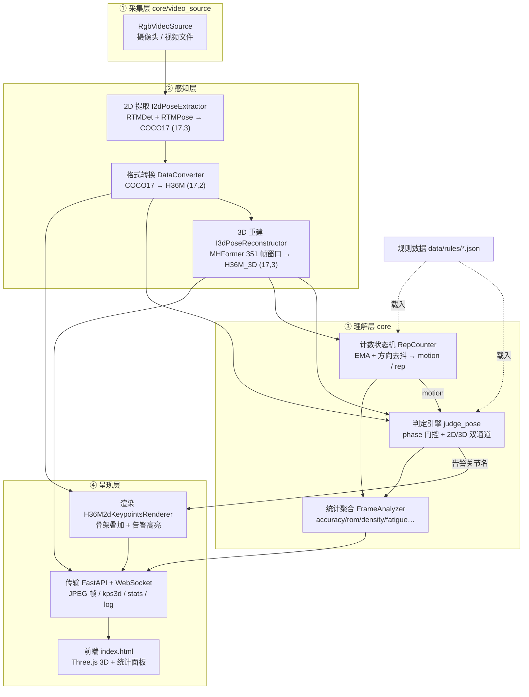
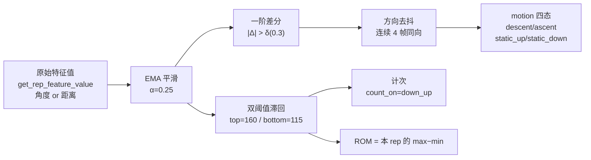

# 技术路线

## 1. 项目背景与定位

### 1.1. 问题背景

健身动作的规范程度直接决定训练效果与安全性。深蹲深度不足、膝内扣、左右发力不均等错误模式在单次训练中影响有限，长期重复则会累积为关节与肌肉损伤。而普通人普遍缺乏自我评估动作的能力，"感觉做对了"与"实际做对了"之间存在明显落差。

现有解法各有局限：

- **人工指导**：能够准确判断动作质量，但成本高、不可持续，无法覆盖日常训练。
- **可穿戴设备**：以心率、步数等宏观生理量为主要指标，无法观测动作形态，回答不了动作是否规范。
- **通用姿态识别**：可完成动作计数与分类，输出的是做了几次、做的是什么动作，仍不涉及完成质量。

单目摄像头已经普及，姿态估计模型也已成熟，"用一台设备看懂动作"具备了工程可行性。真正的缺口在于：如何让设备在本地实时给出规范性判定，并让新增动作的适配成本足够低。

### 1.2. 项目定位

实时 2D/3D 人体姿态估计的健身动作分析管道：从摄像头/视频取帧，提取骨骼关键点，重建 3D 姿态，按可配置规则判定动作质量、统计次数与训练指标，并把结果与叠加骨架实时推送到浏览器。

| 维度     | 定位                                                                      |
| -------- | ------------------------------------------------------------------------- |
| 运行形态 | 端侧（设备本地）实时分析，不依赖云端推理                                  |
| 目标硬件 | Qualcomm QCS8550（ARM CPU + Hexagon DSP），AidLux 环境                    |
| 交付形态 | 一个 FastAPI 长驻服务 + WebSocket 推流 + 浏览器前端，可内嵌为应用后端模块 |
| 核心能力 | 姿态提取 / 3D 重建 / 动作计次 / 规则判定 / 训练统计 / 可视化              |

### 1.3. 技术路线与创新点

1. **规则驱动的动作理解。** 模型仅负责提取人体骨骼（2D 关键点与 3D 重建），动作是否规范不进入模型，而交由 JSON 规则文件描述。新增动作无需重训练、无需重新量化、无需改动推理管线，仅需新增一个规则文件。这是本项目最重要的架构决策，也是它能够覆盖哈克深蹲、高位下拉、俯卧撑、倒蹬类等异构动作的原因。
2. **阶段门控的判定引擎。** 规则可按动作阶段（下降、上升、顶部静止、底部静止）分别生效，使同一关节在不同阶段可以有不同的阈值要求。以哈克深蹲为例，蹲到底要求膝角在 90–115°，站到顶要求 170–180°，两个区间互斥，没有阶段门控时无法同时配置。
3. **2D/3D 双通道判定。** 每条规则按自身几何性质选择坐标源：膝角这类跨矢状面的量用 3D，肩外展、高低肩这类位于冠状面的量用 2D，从而避免让所有判定都承担 3D 重建的窗口延迟与噪声。
4. **计数与判定共享状态机。** 计数状态机以 EMA 平滑、方向去抖与双阈值滞回处理原始特征值，既完成动作计次，也同时产出阶段信号供判定引擎门控使用，使"判定在什么阶段生效"有了可靠依据。
5. **全链路端侧实时。** 关键点提取与 3D 重建均编译为 QNN 上下文运行于 Hexagon DSP，捕获、推理、判定、统计与推流全部在设备本地完成。

---

## 2. 总体架构

### 2.1. 分层视图



### 2.2. 层次职责与代码映射

| 层       | 职责                             | 代码位置                                                                                                                                   |
| -------- | -------------------------------- | ------------------------------------------------------------------------------------------------------------------------------------------ |
| ① 采集   | 产出 BGR 帧，屏蔽摄像头/文件差异 | [core/video_source/](core/video_source/)                                                                                                   |
| ② 感知   | 图像 → 2D 关键点 → 3D 关键点     | [core/kp2d_extractor/](core/kp2d_extractor/)、[core/converter.py](core/converter.py)、[core/kp3d_reconstructor/](core/kp3d_reconstructor/) |
| ③ 理解   | 姿态 → 违规 / 次数 / 阶段 / 统计 | [core/analyzer.py](core/analyzer.py)、[core/pose_judger.py](core/pose_judger.py)、[core/rep_counter.py](core/rep_counter.py)               |
| ④ 呈现   | 渲染叠加、协议推送、前端可视化   | [core/renderer.py](core/renderer.py)、[main.py](main.py)、[static/](static/)                                                               |
| 规则数据 | 动作定义（阈值/阶段/计次参数）   | [data/rules/](data/rules/)                                                                                                                 |
| 模型资产 | QNN 编译后的 `.aidem` 与推理封装 | [rtm-det-aidlite/](rtm-det-aidlite/)、[mhformer-aidlite/](mhformer-aidlite/)                                                               |

依赖方向是单向的：上层依赖下层，下层不感知上层的存在。感知层与理解层之间仅通过关键点数组通信，因此替换任意一层的实现（RTMPose 换为其他 2D 模型、MHFormer 换为其他重建模型）均不影响其余部分。

---

## 3. 关键技术选型

### 3.1. 2D 提取：RTMDet + RTMPose（top-down 两阶段）

| 项     | 取值                                                            |
| ------ | --------------------------------------------------------------- |
| 检测   | RTMDet-m，输入 640×640，80 类，strides (8,16,32)，输出 6 个分支 |
| 关键点 | RTMPose-l，输入 192×256，SIMCC 解码头，`split_ratio=2.0`        |
| 后处理 | 置信度筛选 → 按类 NMS（offset 4096）→ letterbox 反变换          |
| 阈值   | 检测框 0.4、人类别 0.3、最多保留 5 个目标                       |
| 输出   | COCO-17 `(17, 3)` = `[x, y, confidence]`                        |

选用 top-down 而非单阶段多人姿态估计：健身场景中画面内通常只有一到两人，且人物占画面比例较大。top-down 先检测人体边界框，再在框内回归关键点，精度显著高于 bottom-up，代价是每帧需两次推理；在单人场景下该代价被显著摊薄（每帧一次检测加一次单人姿态），并提升了对遮挡与远景小目标的鲁棒性。

采用 SIMCC 而非热力图回归：SIMCC 将关键点定位拆解为 x、y 两个一维分类问题，输出尺寸远小于同精度的热力图，解码仅为一次 `argmax` 与除以 `split_ratio`，在 DSP 上更节省带宽。代价是亚像素精度依赖分布峰值，本项目以 `min(max_x, max_y)` 作为置信度做了简化校准。

### 3.2. 3D 重建：MHFormer（351 帧时序 Transformer）

| 项         | 取值                                                                  |
| ---------- | --------------------------------------------------------------------- |
| 窗口       | 351 帧（当前帧前后各 175 帧），`pad = (351-1)//2 = 175`               |
| 输入       | H36M `(T, 17, 2)` 像素坐标 → `normalize_screen_coordinates` 归一化    |
| 输出       | 取窗口中心帧的 `(17, 3)`，非整段序列                                  |
| TTA        | 默认开启水平翻转增强（翻转 → 推理 → 翻回 → 与原结果求平均）           |
| 坐标后处理 | `camera_to_world`（固定旋转四元数）+ 根关节 x 归零 + z 抬到最小值为 0 |

引入 3D 而非仅使用 2D 的原因在于面外方向的信息损失。深蹲的膝角变化主要发生在矢状面（前后方向），2D 投影会将大腿朝向镜头与朝向画面内侧的两种姿态投影为同一角度，视角稍有偏移即产生失真。MHFormer 从 2D 序列中重建深度方向，此类角度才具备可用性。

采用时序模型而非单帧 3D 提升的原因：单帧 2D→3D 是病态问题，一张图像对应无穷多组 3D 解。MHFormer 以 351 帧的上下文作为约束，等价于引入人体在时间上连续运动的先验。其代价是延迟与显存、带宽占用：单帧的 3D 结果依赖其前后各 175 帧，这直接决定了后续 2D/3D 双通道的设计。

`to_world` 的取舍：它是刚体旋转加平移归零，不改变任何关节夹角，仅改变坐标数值与各轴尺度。因此对以角度为判据的规则，开启与否结果一致；对前端 3D 显示，开启后骨架姿态处于符合直觉的世界坐标系中。

### 3.3. 推理后端：QNN + aidlite SDK（DSP 加速）

| 项       | 取值                                                                                                                  |
| -------- | --------------------------------------------------------------------------------------------------------------------- |
| SDK      | `aidlite`（AidLux 预装于系统 python）                                                                                 |
| 框架类型 | `TYPE_QNN236`，模型为 `.aidem` 格式（含 `.ctx.bin` 编译产物）                                                         |
| 加速单元 | MHFormer 走 `DSP → NPU → CPU` 降级链（可由 `AIDLITE_ACCELERATE` 覆盖）；RTMDet/RTMPose 固定 `TYPE_DSP` + `TYPE_LOCAL` |
| 加载时机 | 惰性——构造 extractor/reconstructor 不占 DSP，首次 `extract()`/`reconstruct()` 才建解释器                              |
| 生命周期 | 提供 `close()` 与上下文管理器，析构时兜底释放                                                                         |

直接使用 DSP 的原因：QCS8550 的 CPU 无法实时运行 MHFormer 的 351 帧 Transformer。将两个模型编译为 QNN 上下文并部署至 Hexagon DSP，是端侧同时满足实时性与精度的可行路径。

代价与应对：

- **模型不可热更新**：`.aidem` 是离线编译产物，更换模型需经 QNN 工具链重新编译。
- **依赖不可从包管理器获得**：`aidlite` 预装于系统 python，需要 `.venv --system-site-packages`。
- **失败时点晚且位于运行时**：由于惰性导入，缺少 `aidlite` 时服务仍会正常启动并输出画面，直到首次推理才抛出 `ModuleNotFoundError`；该异常被主循环兜底捕获，日志中仅留下一行 `Unexpected error in streaming loop`。

### 3.4. 内部关节表示：H36M 17 点

内部统一采用 H36M 而非 RTMPose 原生的 COCO-17，原因在于 3D 重建模型 MHFormer 基于 Human3.6M 数据集训练，其输入输出关节编号即为 H36M 17 点。内部表示的选择取决于不可改动的一端：模型端不可改，因此将格式转换放在 CPU 侧一次性完成，其余链路统一使用 H36M。

转换规则（[core/converter.py](core/converter.py)）：11 个关节直接映射（肩/肘/腕/髋/膝/踝），6 个关节由几何插值补齐。

| H36M 关节 | 来源                           |
| --------- | ------------------------------ |
| `pelvis`  | 左右髋中点                     |
| `thorax`  | 左右肩中点                     |
| `spine`   | `pelvis` 与 `thorax` 的中点    |
| `neck`    | 直接用 `nose`（不做颈椎估计）  |
| `head`    | 双眼中点 + 1.5×(双眼中点 − 鼻) |

该转换是有损的：COCO 的置信度被丢弃，输出 `(17, 2)` 无置信度通道；耳、眼四个点不进入 H36M 表示，仅用于计算 `head`。关键点拓扑见 [h36m骨骼图.md](h36m骨骼图.md)。

### 3.5. 服务与传输：FastAPI + 单 WebSocket 多路复用

- **FastAPI + Uvicorn**：启动参数与 REST 控制面（`/poses`、`/control/*`、`/stats/*`、`/history`、`/api/upload_npz`）复用同一套框架，前端静态文件由 `StaticFiles` 挂载。
- **单条 WebSocket 承载全部数据流**：避免多连接带来的状态同步问题。消息分为四类，通过二进制帧承载视频、JSON 承载控制与数据的方式分流：

| 类型               | 内容                                   | 频率     |
| ------------------ | -------------------------------------- | -------- |
| Binary (Blob)      | JPEG 帧（视频 + 2D 骨架叠加），质量 50 | 每帧     |
| `{"type":"kps3d"}` | 17×3 坐标 + `motion` + `feature_value` | 每帧     |
| `{"type":"stats"}` | 全部训练统计 + `state` + `training_id` | 每 30 帧 |
| `{"type":"log"}`   | 违规与计次事件文本                     | 事件驱动 |

- **JPEG 质量 50**：骨架叠加仅需轮廓可辨，降低质量可显著减少编码耗时与带宽占用（640×480 下单帧约几十 KB）。
- **前端零构建**：原生 HTML/JS，Three.js 经 CDN 引入。无 npm 与打包步骤，部署时不存在前端构建产物需要同步，对端侧设备而言是较为务实的选择。

### 3.6. 三项选型的共同逻辑

选型遵循同一原则：在满足精度的前提下，将通用能力下沉至端侧模型，将业务差异上浮至配置层。

| 需求变化     | 需改动的东西                     | 无需改动的东西         |
| ------------ | -------------------------------- | ---------------------- |
| 新增动作     | 一个 JSON 规则文件               | 模型、推理管线、前后端 |
| 调整判定阈值 | 修改规则文件                     | 代码                   |
| 更换 2D 模型 | 一个 `I2dPoseExtractor` 实现     | 判定、计数、渲染、前端 |
| 更换 3D 模型 | 一个 `I3dPoseReconstructor` 实现 | 判定、计数、渲染、前端 |

---

## 4. 数据流与接口契约

### 4.1. 单帧完整链路

| #   | 环节         | 输入                          | 输出                           | 备注                                      |
| --- | ------------ | ----------------------------- | ------------------------------ | ----------------------------------------- |
| 1   | 取帧         | —                             | BGR `(H,W,3)` uint8            | 摄像头或预录视频文件                      |
| 2   | 2D 提取      | 帧                            | COCO17 `(17,3)`                | RTMDet + RTMPose                          |
| 3   | 格式转换     | COCO17 `(17,3)`               | H36M `(17,2)`                  | `data_out=="H36M"` 时跳过                 |
| 4   | 入滑动窗口   | H36M `(17,2)`                 | `deque(maxlen=351)`            | 窗口即 MHFormer 的时间上下文              |
| 5   | 3D 重建      | 窗口 `(T,17,2)` + 帧尺寸      | H36M_3D `(17,3)`               | 取 `frame_indices=[-1]`，即窗口末帧       |
| 6   | 计次状态机   | 3D `(17,3)`                   | `motion` / `rep_counted` / ROM | 仅消费 3D，与规则的 `keypoints_mode` 无关 |
| 7   | 姿态判定     | 2D + 3D + 规则 + `motion`     | 违规规则 ID + 告警关节名       | 每帧全量判定，再由 analyzer 去抖          |
| 8   | 违规定时上报 | 本帧违规集合                  | 对外 `violations`              | 持续 30 帧才报，同段只报一次              |
| 9   | 渲染         | 帧 + H36M `(17,2)` + 告警索引 | 叠加骨架的 BGR 帧              | 告警点及其两端都在告警集内的连线高亮      |
| 10  | 打包推送     | 以上全部                      | `AnalysisResult` → WS          | 含 JPEG、`kps3d`、`motion`、`rep_counted` |

### 4.2. 坐标语义

| 数据         | 形状     | 坐标系                                                        |
| ------------ | -------- | ------------------------------------------------------------- |
| COCO17 2D    | `(17,3)` | 像素坐标 `[x, y, conf]`，y 向下（OpenCV 约定）                |
| H36M 2D      | `(17,2)` | 像素坐标 `[x, y]`，无置信度                                   |
| H36M 3D      | `(17,3)` | 归一化空间坐标，量级约 ±1，`to_world` 旋转后 y 向下、z 为深度 |
| `frame_size` | `(2,)`   | `(width, height)`；顺序填反会静默产生错误的 3D 结果，且不报错 |

### 4.3. 时间语义

同一帧内，2D 与 3D 的时间含义不同：

- `kp2d_h36m` 描述当前帧状态，逐帧计算、逐帧可用，无历史依赖。
- `kps_3d` 描述当前帧在最近 351 帧上下文中的重建结果，带窗口依赖；序列开头不足 351 帧时以边缘填充补齐，此时结果可信度下降。
- 主循环中 `judge_pose` 使用的 `motion` 来自上一帧 `RepCounter` 的输出（本帧的 `update()` 在判定之后才调用），存在 1 帧滞后。

上述差异是 2D/3D 双通道设计的直接依据：既然 3D 客观上延迟更高、噪声更大，能以 2D 判定的规则就不应被强制绑定到 3D 链路上。

---

## 5. 算法技术路线

### 5.1. 动作计数

早期版本直接以原始特征值（如膝角）与阈值比较。实测表明，关键点的逐帧抖动会使特征值在阈值附近反复跨越，导致一次动作被计为多次。

当前路线为四级串联的状态机，每一级解决上一级遗留的问题：



EMA 是必要前提而非可选优化：`motion` 的方向判定依赖平滑值的导数。若不平滑，逐帧噪声会被差分放大，方向信号剧烈跳变，后续的方向去抖将退化为无意义的多数投票。α=0.25 表示当前帧权重为 1/4，等效时间常数约 4 帧。

采用双阈值滞回的原因：单阈值下，特征值在临界点附近的正常生理波动会被反复计为动作。双阈值（≥160 判为伸展、≤115 判为收缩、中间区间维持原状态）构造出滞回带，吸收边界抖动。滞回带宽度同时定义了完成一次动作的判据，哈克深蹲取 115→160，对应蹲到底至站直。

方向切换另需 4 帧去抖的原因：平滑之后仍可能残留单帧抖动，而 phase 门控是瞬时开关，motion 的抖动会导致规则反复启停，判定失去意义。因此对已平滑的信号再做一次连续性投票。

motion 四态不可合并为两态的原因：规则语义要求这一粒度。"蹲到底时膝角为 90–115°"（`static_down`）与"下蹲过程中膝角不得突降"（`descent`）是两类不同的检查意图，合并为笼统的"下半程"后无法配置。

`count_on` 可配置的原因：不同动作对完成态的定义不同。深蹲类以回到伸展态为完成（`down_up`），卷腹类以到达收缩态为完成（`up_down`）。

### 5.2. 姿态判定

1. **展平**：将 `rule_set` 的"规则组 + `parts`"结构展平为一条 part 对应一条规则，并将组级的 `phase`、`keypoints_mode` 继承至每个 part。
2. **分组**：以关节名组合作为分组键，四点规则归入 `("segment4", p1..p4)`，两点规则归入 `("horizontal", p1, p2)`。同一组合下的多条规则（如左右腿或多档阈值）共享一次几何计算。
3. **过滤**：按 `phase` 剔除本帧不应生效的规则组。无 `phase` 或含 `"all"` 时恒生效，否则仅当当前 `motion` 命中列表时才参与判定。
4. **判定**：按组内首条的 `keypoints_mode` 选择 2D 或 3D 坐标，计算一次角度，组内所有规则的 `[min_value, max_value]` 区间共用该结果；只要有一条区间命中即不判为违规。

`keypoints_mode: "2d"` 时，四点坐标补 `z=0` 后统一走三维几何接口，两种模式复用同一套函数，无需维护两份几何实现。

允许同一份规则中部分规则使用 2D、部分使用 3D 的原因：3D 精度更高但存在窗口延迟与重建噪声，2D 实时性更好但存在投影失真，两者各有代价。取舍依据是动作是否主要发生在矢状面：

- 哈克深蹲的膝角 → `3d`：深度变化大，2D 下视角偏移即导致角度错误。
- 高位下拉的肩外展、高低肩 → `2d`：动作基本位于冠状面内，正面拍摄已可准确测量，经由 3D 只会额外引入延迟与噪声。

违规另需去抖的原因：`judge_pose` 每帧都返回违规集合，但分析器不立即上报。它记录每个违规 ID 首次出现的帧号，仅当持续超过 30 帧（约 1 秒）且未上报过时才对外发出；同一段违规只上报一次，待其从集合中消失后才重置。阈值 30 帧与一次动作的正常耗时同量级，用于滤除动作过渡瞬间的短暂越界。

### 5.3. 统计指标计算路线

| 指标            | 计算式                                                           | 依赖                  |
| --------------- | ---------------------------------------------------------------- | --------------------- |
| `accuracy`      | `1 − 违规帧数 / 有效分析帧数`                                    | 仅 `running` 态累加   |
| `rom`           | 每次 rep 的 `max−min` 特征值，取均值                             | `RepCounter` ROM 序列 |
| `balance_score` | `100 − 变异系数×100`，`cv = std/mean(ROM)`                       | 需 ≥2 次 rep          |
| `density`       | `rep_count / 训练分钟数`                                         | 墙钟时间              |
| `calories`      | `rep_count × calories_per_rep`（规则文件给常数）                 | 查表                  |
| `fatigue_score` | `ROM 衰减率×0.4 + 速度衰减率×0.3 + 违规上升率×0.3`，需 ≥4 次 rep | 前半段 vs 后半段对比  |

取数方式共四种：WebSocket 每 30 帧推送、`GET /stats/latest`、`GET /history` 列表加 `/stats/{id}`，以及内嵌时直接读 `FrameAnalyzer` 属性（为应用端集成预留的路径）。

---

## 6. 规则数据路线

规则文件是本方案中业务逻辑的唯一载体，放在 [data/rules/](data/rules/)，按文件名（即动作名）加载。

### 6.1. 规则生产：Rule Builder

规则不宜手工编写，阈值必须从真实数据中测量得出。为此提供可视化工具（[static/rule-builder.html](static/rule-builder.html)，`bash run-rule-builder.sh`）：上传视频与 2D/3D 骨骼 `.npz`，在 SVG 骨骼图上点选测量段，逐帧拖动查看实时角度，录入 `[min, max]`，导出 JSON。

该路线解决的是规则阈值的来源问题：`delta_threshold=0.3`、膝角 115/160 等取值并非主观设定，而是在 example-1 的真实 3D 序列上测量得到的。

### 6.2. 算法验证：EMA 演示页

计数状态机的三个参数（`ema_alpha` / `motion_debounce` / `delta_threshold`）直接决定 motion 的稳定性，其合理取值只能通过观察真实信号确定。为此设有独立的验证页 [demo_ema/ema.html](demo_ema/ema.html) 与辅助服务 [demo_ema/ema.py](demo_ema/ema.py)（端口 28080，`bash run-ema.sh`，与主服务 2800 互不冲突）：

| 标签页   | 数据来源                  | 依赖服务端 |
| -------- | ------------------------- | ---------- |
| 仿真     | 内置信号 + 可调噪声       | 否         |
| 真实数据 | 上传视频 + 3D 骨骼 `.npz` | 是         |

服务端提供三项能力（四个端点），起因均为浏览器无法直接处理 numpy 的 `.npz` 容器格式：

| 端点                 | 用途                                                                             |
| -------------------- | -------------------------------------------------------------------------------- |
| `/api/parse_kp3d`    | 解析上传的 3D H36M 骨骼，返回逐帧 `[x,y,z]`                                      |
| `/api/parse_kp2d`    | 解析 2D 骨骼（同样为 `(frames,17,3)`，第三列是置信度，服务靠量纲区分并拒绝错配） |
| `/api/derive_kp3d`   | 自动推导：上传视频 → RTMPose 提 2D → MHFormer 升维，全程走本机 QNN               |
| `/api/derive_status` | 轮询推导进度（后台线程执行，结果只留内存不落盘）                                 |

`/api/derive_kp3d` 的价值最高：它补齐了"现场录制视频 → 立即获得 3D 骨骼 → 在页面上调参或在 Rule Builder 中测量阈值"的闭环，不再依赖离线的 Python 脚本预先提取 `.npz`。实测约 85 ms/帧（RTMPose 约 67 ms + MHFormer 约 18 ms），因此该接口采用后台线程加进度轮询，而非同步返回。

三项工具的共同定位：由于业务逻辑不写入模型，参数标定能力即为核心生产力。Rule Builder 解决阈值如何确定，EMA 演示页解决平滑与去抖参数如何确定。

---

## 7. 部署与运行路线

交付形态为摄像头加真实分析器。为支持在无 QNN 硬件的环境下开发与调试，视频源与 2D/3D 分析器均可切换为 mock 实现，以预录视频与缓存骨骼数据替代摄像头与 QNN 推理；此时判定、计次、统计与前端照常运行，仅推理环节被替换。各运行模式的启动脚本见 [README](README.md)，运行环境约束见附录 C。

---

## 8. 应用价值与落地

适用场景：

- **健身动作的实时规范性反馈**：单目摄像头即可工作，无需可穿戴设备或多目方案，视频不出设备。
- **康复训练与体育教学的动作监测**：阈值可按训练者与训练阶段调整，规则文件可针对不同难度分别编写。
- **作为能力模块嵌入现有健身应用**：服务可独立运行（WebSocket 推流加浏览器前端），也可作为库内嵌为宿主应用的后端模块，直接读取 `FrameAnalyzer` 的属性。

可复制性：整套方案不依赖云端推理，单台 QCS8550 级设备即可完成捕获、推理、判定与推流。新增动作的适配成本仅为编写一个规则文件——阈值由可视化工具从样例视频中测量得出，无需算法团队介入，也无需重新训练或量化模型。

---

## 9. 已知限制与技术风险

### 9.1. 算法与建模限制

| 限制       | 说明                                                                       | 当前状态                                 |
| ---------- | -------------------------------------------------------------------------- | ---------------------------------------- |
| 单人假设   | 2D 提取只返回得分最高者；画面出现第二人时会静默丢弃                        | 按场景设计，暂不需修改                   |
| 3D 冷启动  | 序列前 351 帧靠边缘填充补齐窗口，重建质量随窗口填充而下降                  | 由 MHFormer 的窗口机制决定，只能尽量减缓 |
| 时序不一致 | 3D 相对 2D 有窗口级延迟；`judge_pose` 用的 `motion` 来自上一帧（1 帧滞后） | 已通过 2D/3D 双通道部分规避              |

---

## 10. 演进路线

### 第一阶段：动作相似性判定（模型化第一步）

目标：在规则判定之前插入一个动作相似性判定环节。这一环节不进行动作分类，仅用于判断当前的骨骼序列是否与选定的动作相似。判定为不相似时，直接给出粗略告警并跳过本帧的细判；判定为相似时，才将控制权交给程序化规则判定。

必要性：现有链路默认画面中的人正在执行选定动作，该前提从不被校验。阈值与计次参数全部按所选动作计算，一旦实际动作与之不符，会持续报出无意义的违规，统计整体失真。规则引擎仅以给定阈值比较，不具备"当前动作与所选动作不符"这一表达能力，误报必须在判定之前拦截。

可行性：判定输出为二值而非动作类别，负样本易构造，难度低于分类模型；也可先退化为与标准模板的相似度比对，无需训练即可打通链路。判定器以骨骼序列与动作标识为输入，插入点在 3D 重建之后、`judge_pose` 之前，下游无需改动。样本可由 `/api/derive_kp3d` 从现有视频产出，并可先以旁路运行、确认准确率后再切换为门控。

行为与资源约束：不相似时发出可区分的粗略告警（独立消息类型）；仅跳过 `judge_pose` 与 `RepCounter`，提取、渲染与推流照常执行，该时段不计入 accuracy 分母。判定为序列性质，可在滑动窗口或 rep 边界上得出结论并对其去抖，因此判定器可保持很小规模（DSP 已被 2D/3D 推理占满），无需每帧执行。

### 第二阶段：全骨骼偏移评定模型（模型化第二步）

目标：由模型比较待评估动作与标准动作，输出各部位的多维偏移评定，再由可插拔的小模型转换为违规消息（如"下蹲幅度不足"）。

定位：长期目标是替代规则引擎。规则引擎无法表达整体是否接近标准动作，也给不出偏差的渐变信息。但这目前仍是愿景：评定模型能否在端侧可接受的精度与训练成本下达到可用，尚无验证；在被证明可行之前，规则引擎仍是唯一经过验证的判定手段。

分层原因：偏移量是连续量，可解释、可复算，可供前端高亮、语音引导、训练报告等多方消费；将自然语言转换独立出去，更换语言或话术策略均无需改动模型。

关键工程问题：骨骼序列的时间对齐（需 DTW 或分段归一化）、坐标系归一化（必须先消除个体身型与站位差异）、偏移评定的定义需稳定可测、标准动作的来源（规则文件配套录制或用户历史动作的中位数序列）。

与第一阶段的关系：第二阶段依赖第一阶段。先确认当前动作是目标动作，才谈得上评估其完成质量。

---

## 附录 A：关节索引与骨骼拓扑

H36M 17 点索引（全链路统一约定，判定规则的关节名即映射到此处）：

| idx | 名称   | idx | 名称   | idx | 名称   |
| --- | ------ | --- | ------ | --- | ------ |
| 0   | 骨盆   | 6   | 左脚踝 | 12  | 左肘   |
| 1   | 右髋   | 7   | 脊柱   | 13  | 左手腕 |
| 2   | 右膝   | 8   | 胸腔   | 14  | 右肩   |
| 3   | 右脚踝 | 9   | 鼻子   | 15  | 右肘   |
| 4   | 左髋   | 10  | 头顶   | 16  | 右手腕 |
| 5   | 左膝   | 11  | 左肩   |     |        |

骨骼连线（16 条，渲染与前端 3D 共用同一套拓扑）：

```text
            10 (头顶)
            |
            9 (鼻子)
            |
            8 (胸腔/颈底)
       /    |       \
     /      |         \
  11 (左肩)  |          14 (右肩)
    |        |          |
12 (左肘)    |          15 (右肘)
    |        |          |
13 (左腕)    |          16 (右腕)
            |
            7 (脊椎)
            |
            0 (骨盆)
          /   \
        /       \
      4 (左髋)   1 (右髋)
      |           |
      5 (左膝)   2 (右膝)
      |           |
      6 (左踝)   3 (右踝)
```

拓扑图见 [h36m骨骼图.md](h36m骨骼图.md)；定义在 [core/renderer.py](core/renderer.py) 的 `_H36M_POSE_CONNECTIONS` 与 [main.py](main.py) 的 `H36M_BONES`。

## 附录 B：运行环境约束

1. `.venv` 必须以 `--system-site-packages` 创建——`aidlite` 预装在系统 python，普通隔离 venv 无法使用。该选项的语义是"合并，venv 优先"，同名的包以 venv 版本为准。
2. `numpy` 钉在 `>=1.26,<1.27`——`aidlite` 的 `.so` 按系统 numpy（1.26.4）编译，venv 的 numpy 会遮蔽系统版本，跨大版本存在 ABI 隐患。该约束在 [pyproject.toml](pyproject.toml) 中有注释说明。
